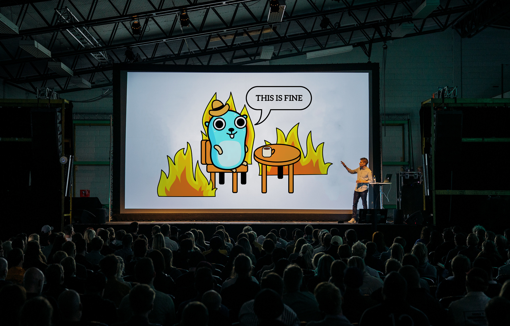
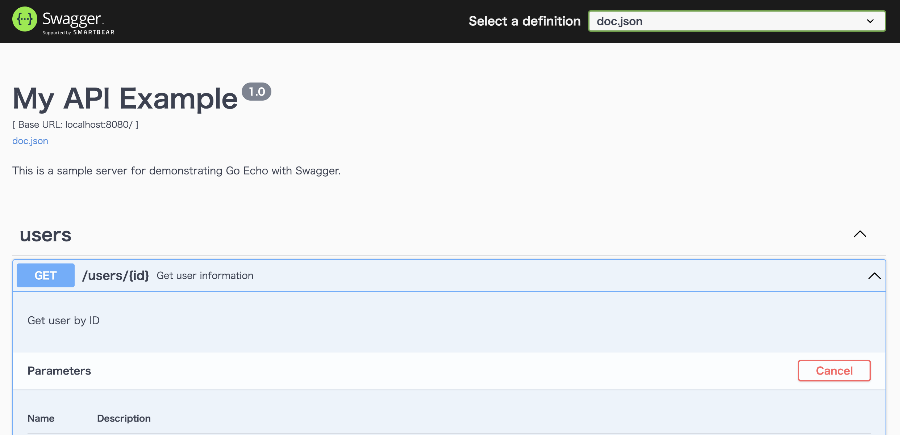

# Go Echo API with Swagger UI 
This is a simple REST API built with Go using the Echo framework and Swagger UI for API documentation.

## Project Structure

```
myapp/
├── cmd/
│   └── main.go            # Entry point of the application
├── config/
│   └── config.go          # Configuration settings
├── docs/
│   └── docs.go            # Swagger docs setup
├── internal/
│   ├── handler/
│   │   └── user.go        # User handler
│   └── model/
│       └── user.go        # User model
├── routes/
│   └── routes.go          # Routes setup
├── go.mod                 # Go module file
└── go.sum                 # Go dependencies file
```

## Prerequisites

- [Go](https://golang.org/dl/) (version 1.16 or higher)
- [Swag](https://github.com/swaggo/swag) for generating Swagger documentation

## Installation

1. Clone the repository:
   ```sh
   git clone https://github.com/yourusername/myapp.git
   cd myapp
   ```

2. Initialize Go modules:
   ```sh
   go mod tidy
   ```

3. Install Swag for generating Swagger documentation:
   ```sh
   go install github.com/swaggo/swag/cmd/swag@latest
   ```

4. Generate Swagger documentation:
   ```sh
   swag init -g cmd/main.go
   ```

## Running the Application

To run the application, use the following command:

```sh
go run cmd/main.go
```

The server will start at `http://localhost:8080`. You can access the Swagger UI for API documentation at:

```
http://localhost:8080/swagger/index.html
```

## API Endpoints

- `GET /users/:id` - Retrieve user details by ID

## Configuration

The application uses environment variables for configuration. You can create a `.env` file in the root directory to specify these variables.

## Project Dependencies

- [Echo](https://github.com/labstack/echo) - High performance, extensible, minimalist Go web framework
- [Swaggo](https://github.com/swaggo/echo-swagger) - Swagger integration for Echo
- [Godotenv](https://github.com/joho/godotenv) - Loads environment variables from `.env`.

## License

This project is licensed under the MIT License - see the [LICENSE](LICENSE) file for details.

## Contributing

Feel free to submit issues, fork the repository and send pull requests!


